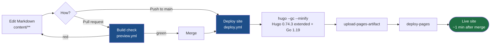
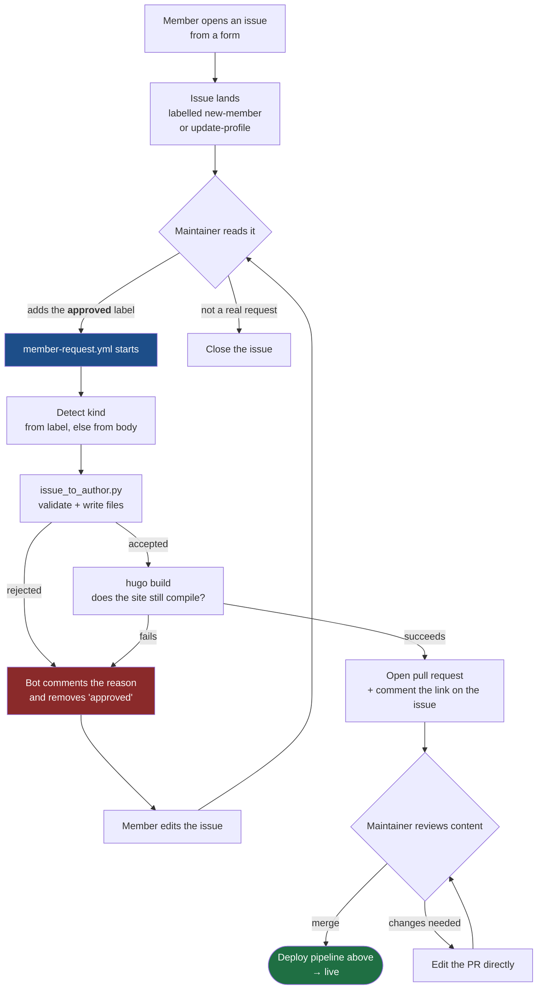

# How the website works

Two independent pipelines. **Publishing** turns Markdown on `main` into the live site.
**Contributing** turns a request from someone without write access into a pull request.

## 1. Publishing — Markdown in, live site out

Nothing generated is ever committed. `public/` is gitignored and exists only on the runner.



The build check on a pull request runs the identical Hugo build but stops before deploying,
attaching the built site as a downloadable artifact. A red check means the site would not
build — the run log says which file broke it.

## 2. Contributing — a form becomes a pull request

Lab members do not need write access. They file an issue; a maintainer approves it; the
automation writes the files.



### Why the `approved` label is the gate

`member-request.yml` holds a token that can write to the repository, and an issue body can be
written by anyone with a GitHub account. Gating on a label means a human has looked at the
request before any of that runs. Issue text reaches every step through `env:`, is never
interpolated into a `run:` block, and is only ever written to disk as data.

### What the script derives rather than asks

The fields that used to be typed and got silently mistyped are now computed:

| Field | Derived from | Example |
|---|---|---|
| Folder name | Full name, transliterated | `Tamara Müller` → `TamaraMueller` |
| `authors:` key | The folder name | always matches, by construction |
| `last_name` | Last word of the full name | `Nil Stolt-Ansó` → `Stolt-Ansó` |
| Social icons | The host of each pasted URL | `scholar.google...` → `google-scholar` / `ai` |
| Affiliation | Default TUM entry | overridable with one optional field |

Group is a dropdown validated against `content/home/people.md` at runtime, so a group that
does not exist cannot reach the site. Previously a typo there made the person render nowhere
at all, with no error.

## 3. What runs when

| Workflow | Trigger | What it does |
|---|---|---|
| `deploy.yml` | push to `main`, manual | Builds and deploys to GitHub Pages |
| `preview.yml` | pull request | Builds without deploying; uploads the site as an artifact |
| `member-request.yml` | `approved` label added to an issue | Issue → validated files → build → pull request |
| `scripts.yml` | changes under `.github/scripts/`, forms, or `people.md` | 34 unit tests + form/site consistency check |

## 4. Repository shape

```
content/          the site's actual content - this is what people edit
  authors/        one folder per person: _index.md + avatar.<ext>
  publication/    papers
  post/           news
  theses/         open theses
  home/           homepage sections, incl. people.md which defines the groups
config/_default/  site title, menus, theme options
assets/scss/      custom styling
layouts/          template overrides, incl. the custom People widget
static/           files served as-is
.github/
  workflows/      the four workflows above
  scripts/        issue_to_author.py + its tests
  ISSUE_TEMPLATE/ the two contributor forms
public/           NOT in git - built on the runner, gitignored
```
